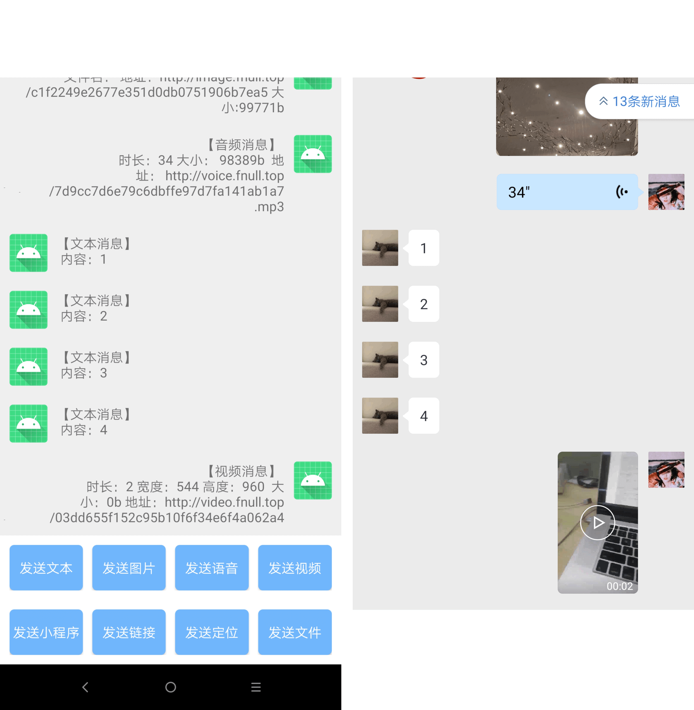
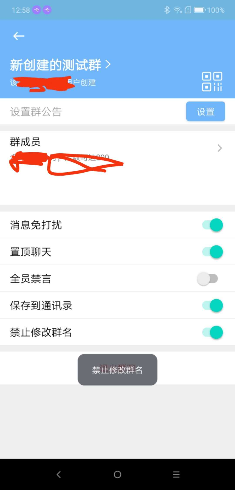

一个使用Kotlin编写的半开源企业插件框架，底层需要 Xposed 或 VirtualXposed 等Hooking框架的支持，目前项目主要针对wework进行逆向学习。

### 最重要事情

**【免责声明】：**
此系列文章主要关于xposed的相关学习，以下所提及到的所有方式皆为学习，如有他人使用本系列学习文章中所提及的知识点用于其他非法用途，本人不承担由此造成的任何后果！！

### 全部功能文档列表，持续更新

当前适配版本从2.8.12 ~ **3.0.36**最新版

**主要功能列表**

- 好友、联系人、用户相关

> - 联系人列表监听：好友数量变化、联系人变化、同步状态变化等
> - 修改联系人备注修改：备注名、企业名、电话、描述、备注的名片或图片
> - 内部成员备注修改：备注名、描述
> - 联系人操作：通过id获取、添加联系人、删除联系人、搜索联系人、通过好友申请、拒绝添加、删除申请、标记客户等等
> - 用户信息：获取公司信息、获取二维码、获取不同风格的二维码、修改头像、修改职务等
> - 部门联系人：获取所有部门信息、获取部门内部信息、获取组织架构、获取父级部门、获取子部门等

- 会话相关

> - 群列表监听：同步状态、添加到群内、退出群聊
> - 群会话监听：添加成员、群主变化、收到消息、群名称变化、成员变化等等
> - 会话操作：获取列表、退出群聊、创建群聊、解散群聊、修改群名称、修改群内昵称、邀请成员、移除成员、搜索会话及联系人、获取群二维码等等
> - 群操作：设置群主、设置入群验证、设置禁言、置顶、保存到通讯录、设置免打扰等等
> - 会话信息：最近消息、成员信息、会话名称、头像、判定是否包含某成员、会话扩展信息、判定是否为微信用户等等

- 消息相关

> - 发送消息：包括但不限于文字、图片、语音、视频、文件、小程序、链接、地理位置等
> - 接收消息：包括但不限于文字、图片、语音、视频、文件、小程序、链接、地理位置等
> - 文件消息自动下载：图片、语音、文件、视频

- 企业微信与微信公用

> - Activity 
> - 文件操作（写入、读取）
> - 数据库操作（增删改查）

- 基础核心功能

> - APK自动解析
> - 异步批处理
> - 二级缓存
> - 网络请求
> - 重试策略
> - 文件下载
> - 自动缓存
> - 反射查找
> - silk音频编解码

当然还有更多的功能不仅限于上述，更多可以查阅我针对企业微信的xposed学习的成果，这些成果的部分我将在后续通过讲解并上传

为了保证执行的可靠稳定性，针对上述功能**在客户端**设计了关于指令的队列处理，解决了很多复杂场景下的问题

如果需要查阅具体接口文档可以与我联系申请查看，我将毫无保留的开放设计理念和文档

### SDK已经可以使用了
以下是根据SDK开发出来的demo，欢迎交流

### 注意：
为了避免某些xxx风险，我只是持续做一些分享，但并不会将完整代码上传，我所上传的基础核心，基本上你都可以在我所写的文章及有Android基础之上一步一步的去实现

### 联系我

如果你在学习过程中遇到问题，你可以直接提交issue，或者直接联系我，请添加时备注：xposed、wework+姓

