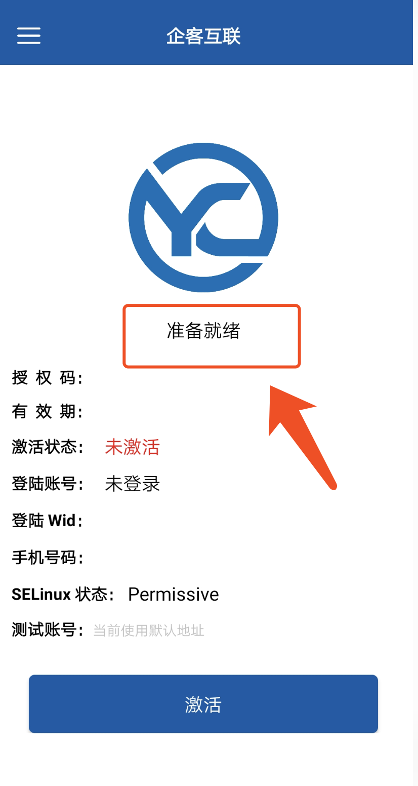
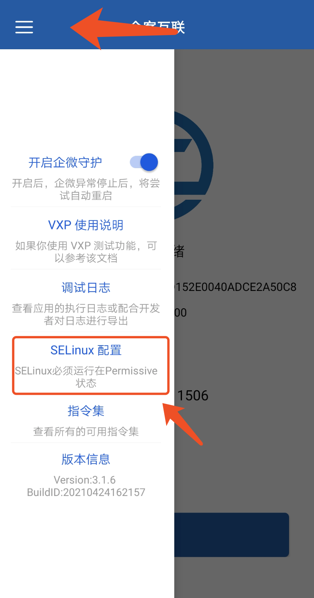
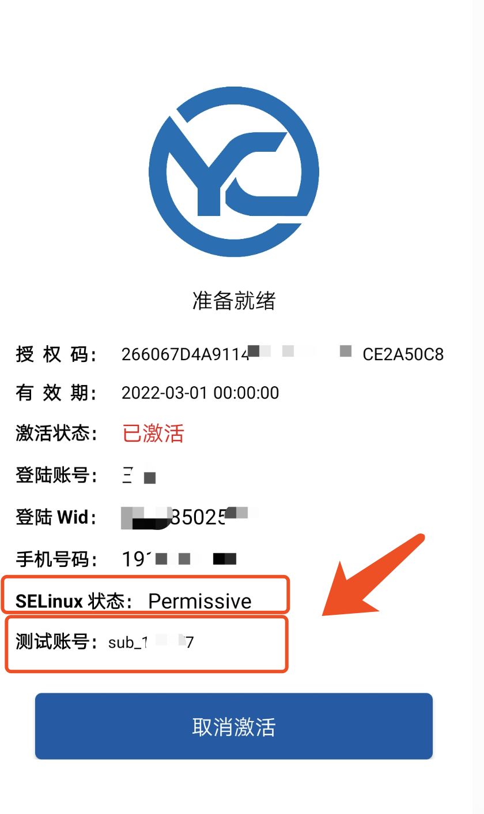
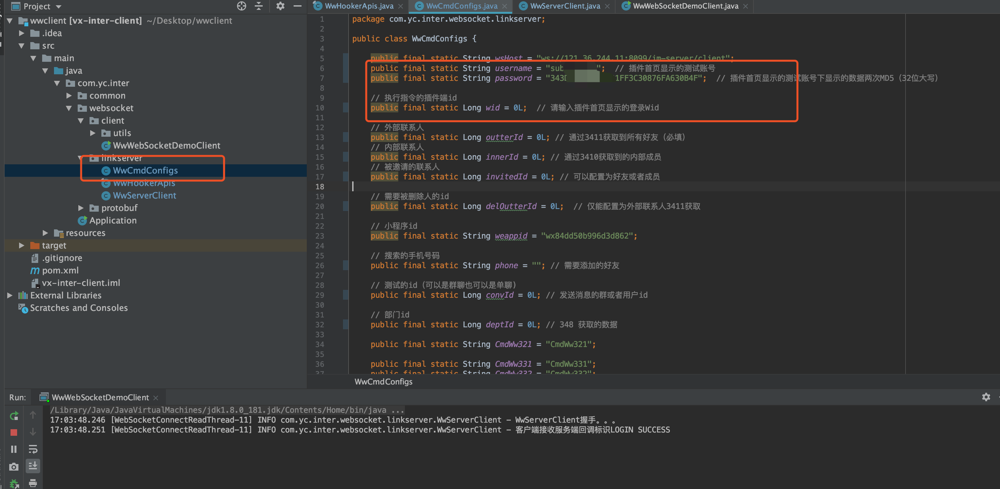
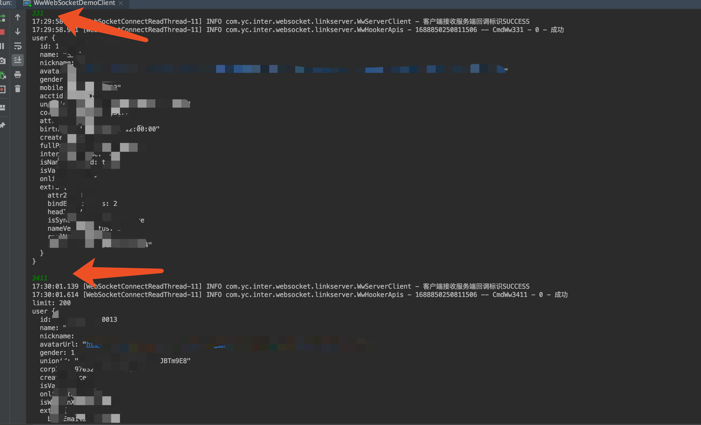

### 前期准备

1、对xposed有一定的了解，知道如何安装及试用

2、由于做了版本自动化适配，99%功能通过自动查找方式匹配，所以需要你去下载[官网的【安装包】](https://work.weixin.qq.com/#indexDownload)

3、下载与官网APK版本一致的[release测玩包](https://github.com/edxposedd/wework/releases)，测玩包支持5.0及以上的

- 【真机】
- 【模拟器】
- 【各类云手机】

### 如何测玩

1、安装好[release测玩包](https://github.com/edxposedd/wework/releases)后，重启手机，如果看到Logo下方显示**准备就绪** 即视为安装好

2、保证当前SELinux处于Premissive，如果非Premissive，需点击左上角设置

3、打开企微并登陆，重新切换至[release测玩包](https://github.com/edxposedd/wework/releases)界面，如下图，点击激活即可

4、下载项目中的 [JavaClientDemo](JavaClientDemo) ，准备好后需要你在[WwCmdConfigs](JavaClientDemo/src/main/java/com/yc/inter/websocket/linkserver/WwCmdConfigs.java)中配置三个重要参数

- username: 即为release包界面上显示的【测试账号的值】
- password: 几位release包界面上显示的【测试账号的值】两次MD5，注意在第一次MD5后需要使用32位大写再次MD5，取最终的32位大写MD5作为密码
- wid：为release包界面上显示的【登录Wid】

上述数据配置好后，可以直接在IDE运行，结果如下即表示初步配置成功

5、接下来是配置其他参数的问题

- 5.1 如果是需要测试创建群聊或者外部群聊相关，则需要配置outterId、innerId，这两个参数可以分别在控制台输入3411 及 3410获取
- 5.2 测试被邀请好友则可以通过3411或者3410获取之后得到一个用户信息配置即可
- 5.3 如果需要测试删除好友则需通过3411获取外部联系人，选择一个即可
- 5.4 测试添加好友则需要配置手机号码
- 5.5 测试群聊相关则可以通过配置好上述数据之后重启client，通过指令355创建一个，返回的数据中会有群聊id，或者通过353获取已有的群聊

6、关于指令的执行测玩

> 目前是配置固定的参数，测试时只需要发送对应文档目录的指令即可，指令执行方从3.3.1开始，目录与指令对应关系为：

> 3.3.1  对应  331
> 
> 3.3.2  对应 332 
> 
> ...
> 
> 3.6.6  对应 366
> 
> ...
> 
> 以此类推
> 
> 建议demo里面不要先测试 退出群聊和解散群聊，这个可以在所有功能测试完毕之后再来验证（因为demo参数是固定配置的群聊id）

### [API接口文档查看](https://docs.qq.com/doc/DS2JLYVpOY2ZJRFJI)

关于每个指令集是代表什么功能，可以直接申请，在申请权限时请写明备注，无备注不会处理，或者可以通过一下群与我们交流

### 与我们进行交流

如果你在学习过程中遇到问题，你可以直接提交issue，或者直接联系我
QQ交流群：**596725067**

请添加时备注：xposed/wework+姓

